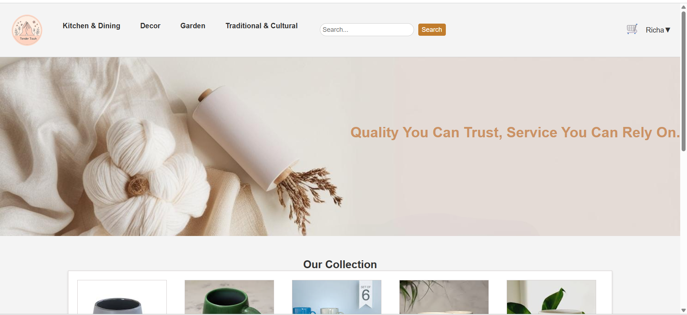
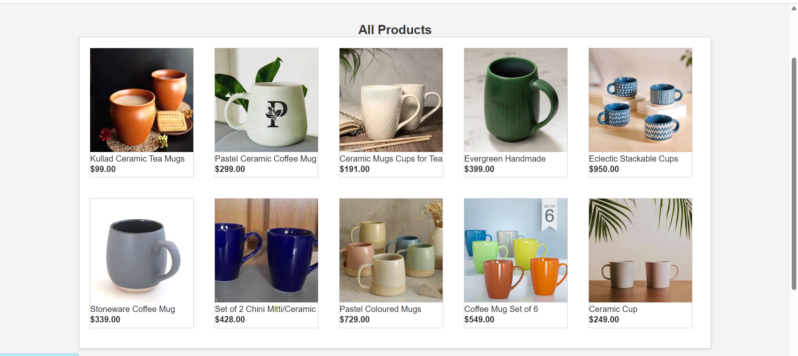
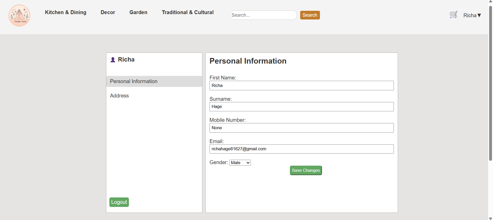
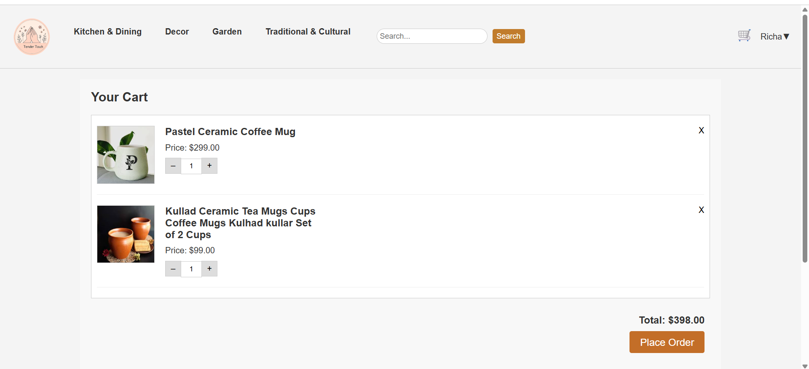
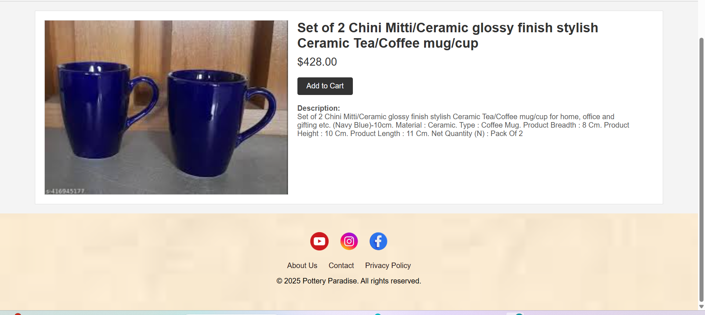
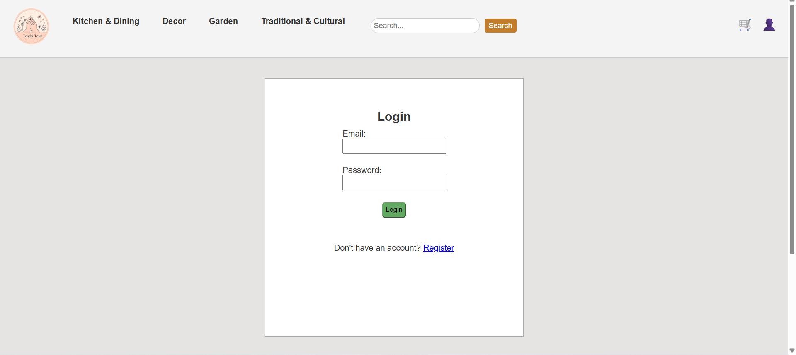
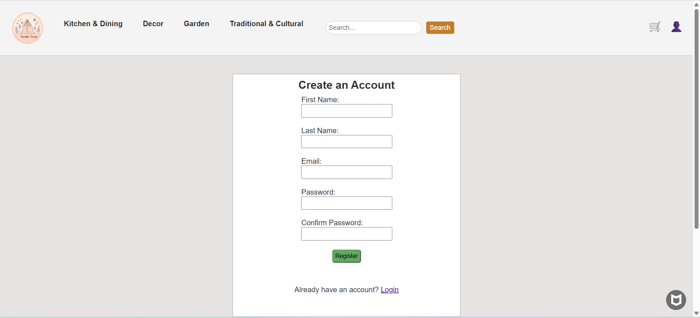

# Tender Touch

A dynamic e-commerce web application for browsing and purchasing handmade pottery products, built with **Flask**, **MySQL**, **HTML/CSS**, and **JavaScript**.


## Features

- 🏠 Home page displaying random pottery products
- 🔍 Search functionality to find products by keywords
- 🛒 Shopping cart with add/remove functionality
- 👤 User authentication: Register & Login
- 🧾 Account page to manage user details
- 🗂️ Browse by categories and subcategories
- 🖼️ Product detail page
- 🪙 Session-based cart management
- 📦 Product database with MySQL
- 🎨 Responsive design using HTML, CSS, and JS


## Technologies Used

- **Frontend:** HTML, CSS, JavaScript 
- **Backend:** Python (Flask)
- **Database:** MySQL
- **Templating:** Jinja2 (with template inheritance using `base.html`)


## Project Structure

```
project/
│
├── static/
│ ├── images/
│ ├── style.css
│ └── script.js
│
├── templates/
│ ├── base.html
│ ├── index.html
│ ├── login.html
│ ├── register.html
│ ├── cart.html
│ ├── account.html
│ ├── product_detail.html
│ ├── search_results.html
│ ├── all_products.html
│ └── subcategory_products.html
│
├── app.py
├── requirements.txt
└── README.md           
```


## Installation

1. Clone the Repository
  ```
  git clone https://github.com/hagericha/Ecommerce-website
  ```

  ```
  cd Ecommerce-website
  ```

2. Create and Activate a Virtual Environment
  ```
  python -m venv venv
  ```

  ```
  #Activate virtual environment
  venv\Scripts\activate
  ```

4. Set Up MySQL Database
  - Open MySQL Workbench
  - Create a new database: pottery_db
  - Run SQL queries to create tables:-

    **Products:**
      ```
      CREATE TABLE products (
        id INT NOT NULL AUTO_INCREMENT,
        name VARCHAR(100) NOT NULL,
        description TEXT,
        price DECIMAL(10,2) NOT NULL,
        image VARCHAR(255),
        subcategory_id INT,
        PRIMARY KEY (id)
      );
      ```

    **Categories:**
      ```
      CREATE TABLE categories (
          id INT AUTO_INCREMENT PRIMARY KEY,
          name VARCHAR(100) NOT NULL
      );
      ```

    **Sub-categories:**
      ```
      CREATE TABLE subcategories (
          id INT AUTO_INCREMENT PRIMARY KEY,
          category_id INT NOT NULL,
          name VARCHAR(100) NOT NULL,
          FOREIGN KEY (category_id) REFERENCES categories(id)
      );
      ```

    **Users:**
      ```
      CREATE TABLE users (
        id INT AUTO_INCREMENT PRIMARY KEY,
        first_name VARCHAR(100),
        last_name VARCHAR(100),
        email VARCHAR(150) UNIQUE,
        password VARCHAR(255)  -- In production, store a hashed password
      );
      ```

    **Cart items:**
      ```
      CREATE TABLE cart_items (
          id INT AUTO_INCREMENT PRIMARY KEY,
          user_id INT NOT NULL,
          product_id INT NOT NULL,
          quantity INT NOT NULL DEFAULT 1,
          UNIQUE KEY unique_cart (user_id, product_id),
          FOREIGN KEY (user_id) REFERENCES users(id),
          FOREIGN KEY (product_id) REFERENCES products(id)
      );
      ```

    **User addresses:**
      ```
      CREATE TABLE addresses (
          id INT AUTO_INCREMENT PRIMARY KEY,
          user_id INT NOT NULL,
          line1 VARCHAR(255) NOT NULL,
          line2 VARCHAR(255),
          city VARCHAR(100) NOT NULL,
          state VARCHAR(100) NOT NULL,
          zipcode VARCHAR(20) NOT NULL,
          FOREIGN KEY (user_id) REFERENCES users(id)
      );
      ```

5. Update DB Credentials in app.py
  ```
  connection = mysql.connector.connect(
      host='localhost',
      user='root',              # Your DB username
      password='YourPassword',  # Your DB password
      database='pottery_db'
  )
  ```

6. Run the Flask App
  ```
  python app.py
  ```


## Screenshots

- Home page
  
  
- Display of all products
  
  
- User account
  
  
- Cart items
  
  
- Product detail
  
  
- Login page
  
  
- Register page
  


